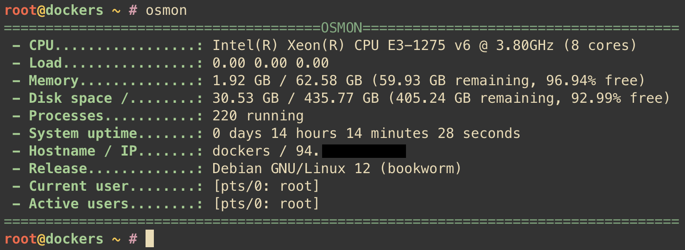
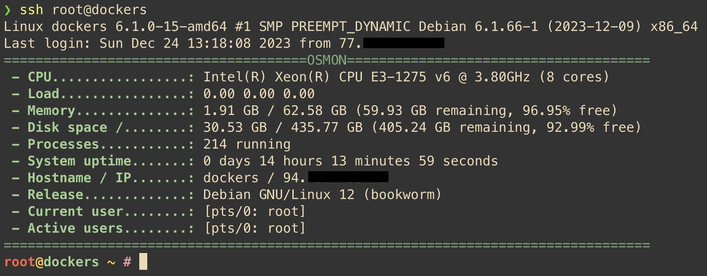

[](https://hits.seeyoufarm.com)
# osmon                

**osmon** is a command-line tool written in Go that provides quick access to basic system information. With **osmon**, you can easily access details such as your host's IP address, system load, memory usage, logged-in users, and much more.

## Features

- Displaying your host's name and IP address.
- Showing the current system load averages.
- Overview of memory usage statistics, including total memory, used memory, and available memory.
- Listing logged-in users and their respective terminals.

## Screenshots

### osmon in Command Line


### osmon for Message of the Day (MOTD)


[//]: # (## Demo Video)

[//]: # ()
[//]: # (Check out this demo of **osmon** in action:)

[//]: # ()
[//]: # ([![Demo Video]&#40;http://img.youtube.com/vi/VIDEO_ID/0.jpg&#41;]&#40;http://www.youtube.com/watch?v=ID_VIDEO "osmon Demo"&#41;)

## Applications

### Monitoring After SSH Login

**osmon** is an ideal tool for a quick overview of a server's status upon SSH login. You can configure your shell to automatically run `osmon` every time you log in, providing an immediate snapshot of the server's status.

Example:

- Configure your `.bashrc` or `.zshrc` to run `osmon` upon every login, allowing you to immediately assess the state of the server.

### Debugging

**osmon** can be an invaluable tool for debugging performance issues. By running `osmon`, you can quickly identify if high system load is caused by memory, CPU, or network activity.

Example:

- If you notice that your application is running slower than usual, you can use `osmon` to check if the system is under heavy load.

### Installation

You can install **osmon** using the Go tool:


`go install github.com/debek/osmon@latest`

After installation, add the Go binary path to your system's PATH to access the `osmon` command from anywhere:


`export PATH=$PATH:~/go/bin`

### Usage

**osmon** offers various command-line options for tailored usage. Below are the available flags and their descriptions:

- `-h`: Display help information. \[...\]
- `-v`: Display the version of the application. \[...\]
- `-i` or `--interval`: Set the interval for refreshing the display in seconds. \[...\]

#### Basic Usage

To simply display the system information, run the `osmon` command without any flags:


`osmon`

#### Continuous Monitoring

If you want to continuously monitor your system's status with a specific refresh interval, use the `-i` flag with your desired interval in seconds:


```bash
osmon -i 5
```

### Binary Release Installation (Optional)

If you release a binary version of **osmon**, users can follow these steps:

1.  Download the binary from the "Releases" section of your GitHub repository.

2.  Move the binary to a directory in your PATH, for example, `/usr/local/bin`:


1.  `mv osmon /usr/local/bin/osmon chmod +x /usr/local/bin/osmon`


## Compatibility

- **osmon** is compatible with Linux and macOS systems.

## Contributing

If you're interested in contributing to the osmon project, please check our [contribution guidelines](https://github.com/debek/osmon/blob/main/CONTRIBUTE.md). All contributions, from bug reporting to new feature suggestions, are highly appreciated.

## License

This project is available under the [MIT License](https://github.com/debek/osmon/blob/main/LICENSE).

## Acknowledgments

Special thanks to the Go community for creating excellent libraries like `github.com/shirou/gopsutil`, which make it easier to gather system information.

## TO DO

- **Information about IOBS and IOPS**: Include details about read and write operations, and possibly any limits.
- **Outgoing and Incoming Connections**: Display connections in kilobits or megabits.
- **Number of Connections**: Show the count of incoming and outgoing connections.
- **Kernel Version**: Add information about the kernel version.